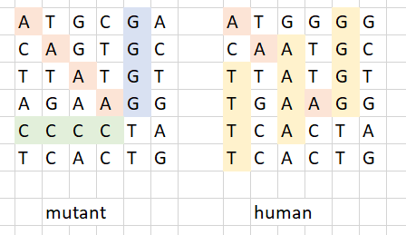

# Mutants API
With this API you can save a person's DNA (String[]) in a database and determine if the person is human or mutant according to the sequences of its coding.



If the person has at least no-repeting-directional sequences of 4 equal letters is mutant, if has less than two, more than one in the same direction or none, the person is human.

Also you can request for the quantity of mutants and humans saved in the data base and its ratio.

*This project is a technical test for MELI*

## Execution of the API

This API is uploaded in an AWS instance and is working in the URL:
http://34.204.2.189:8081/
this works with a cloud database with MongoDB Atlas.

Also you can run the API in local (localhost:8081) by cloning the repository and run:

*build the container*
```
docker build -t mutants-api .
```
*run mongodb*
```
docker-compose up -d
```
*run app*
```
docker run -dp 8081:8081 --name mutants mutants-api
```
you will find in the database some data already load


## Endpoints

**/mutants/**

Is where you can post the ADN

**/stats**

Is where you can query for the statistics

## Decisions made

+ The project is built in java using jdk-11 and MVC pattern. Spring boot is used because of its easyness in the queries, integration with the database and dependencies' injection.
+ For database is used a NoSQL with mongoDB because of its advantages about delivering lower response latencies; and because of the test's description about the assumption of a lot of queries per second, the NoSQL is recommended for large amount of data.
+ The validations for posting DNA are based on: the array must be square: same length of each string and the length of the array, only letters C, T, A, G are valid, and DNA must not exists in the DB.
+ Unit and integration tests are made
+ To enhance performance, queries to the DB for verify the existence of a DNA are cacheable, and for count mutants and humans are made only if a new post was made previously.

## Other documents

In the root of the project you can also find the postman collection and the coverage results of the tests.
